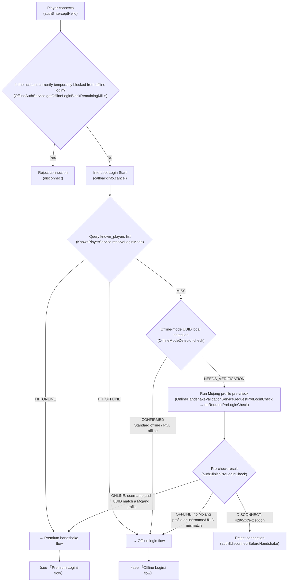
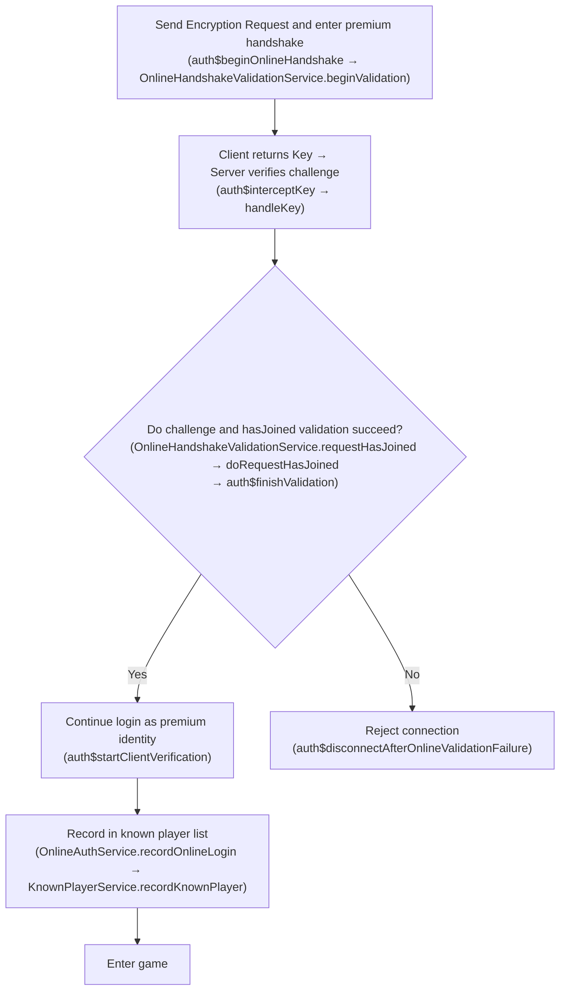
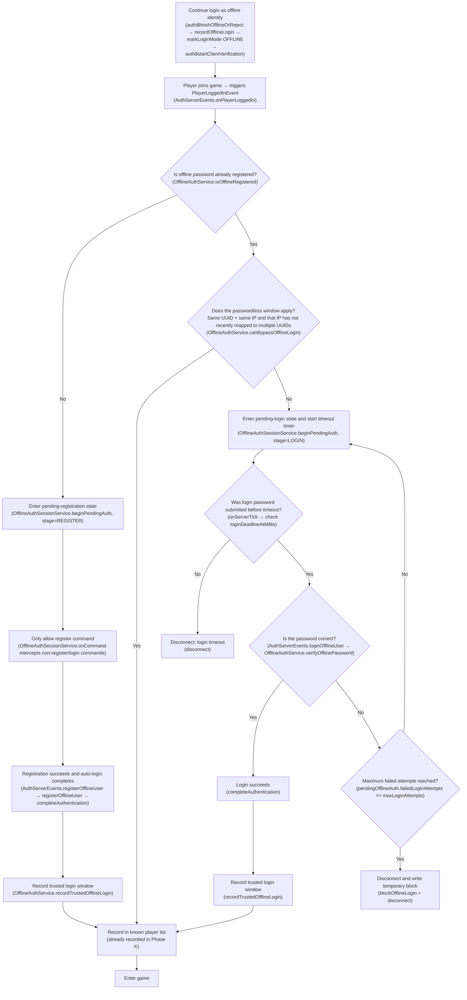

# Offline Login Mod

中文文档见 [doc/README.zh.md](doc/README.zh.md)。

Provides authentication for NeoForge 1.21.1 offline-mode servers.

This mod has a direct goal:

- Offline players can register a password and log in.
- Premium players can complete Mojang online validation on an offline-mode server.
- Offline players cannot move, interact, chat, or view their real inventory until authentication is complete.

## Main Features

### 1. Offline Player Registration and Password Login

- Unregistered offline players can use `register <password> <confirmPassword>` on first join.
- Registered offline players can use `login <password>`.
- Players who are already in-game can use `auth changepassword <password> <confirmPassword>` to change their offline password.

### 2. Premium Account Validation

- When a player connects, the mod actively starts premium handshake and Mojang session validation during the login phase.
- If validation succeeds, the player continues login as a premium account, with the experience consistent with a premium server.
- After a successful premium login, the player uses the premium UUID instead of the offline-mode server-generated UUID, ensuring that mods depending on premium UUIDs (e.g., Figura) work correctly.

### 3. Known Player List Management

- Every successful login (premium or offline) is recorded in the known player list, including UUID, username, and login mode.
- On the next login, the player is routed directly according to their known mode, skipping the Mojang pre-check to avoid hitting API rate limits.
- Administrators can use `auth setmode <UUID|username> <online|offline>` to manually specify a player's login mode.
- If a player is in the list and marked as ONLINE, but premium validation fails, they are rejected immediately.
- Administrators can use `auth remove <UUID|username>` to completely remove all stored data for a player (known player list, offline password, login blocks, and passwordless login records). The player will return to a first-login state on next join.

### 4. Passwordless Login Window

- After a registered offline player logs in successfully, the mod records a trusted login entry for that account UUID and IP.
- Within the configured time window, the same UUID logging in again from the same IP can skip password entry.
- If the same IP is associated with multiple UUIDs during that window, those UUIDs lose passwordless eligibility and fall back to normal password login.

### 5. Isolation Before Authentication

Before an offline player completes registration or login, the mod places the player into a pending-auth state. In that state, the mod:

- Switches the player to spectator mode.
- Locks the player's position and continuously applies blindness.
- Sends an empty inventory view to hide the real inventory.
- Blocks chat, attacks, block interaction, container access, item dropping, and other gameplay actions.
- Allows only the `register` and `login` authentication commands.

### 6. Configurable Security Policies

- Maximum password retry count.
- Temporary block duration.
- Login timeout.
- Repeated prompt interval.
- Minimum password length.
- Password blacklist (auto-created on first startup, directly editable).
- Mojang network request timeouts.
- Default language and automatic player-language detection.

## Login Flow Diagram

The login flow is divided into three phases by responsibility: **Entry Routing** (determining premium or offline path) → **Premium Login** or **Offline Login**.

### Phase 1: Entry Routing — Block Check + Known Player List + Offline UUID Local Detection + Mojang Pre-check



### Phase 2: Premium Login



### Phase 3: Offline Login



## Configuration

### Config File Location

- The server config file is named `auth-server.toml`.
- NeoForge loads this file as a SERVER config.
- For a world-specific override, use `world/serverconfig/auth-server.toml`.
- After changing the config, restarting the server is recommended so that the new authentication parameters are fully applied on the next startup.

### Default Configuration

```toml
[database]
path = "auth/auth"

[offline_login]
max_login_attempts = 3
temporary_block_minutes = 5
trusted_login_window_hours = 24
login_timeout_minutes = 5
prompt_interval_seconds = 5
bcrypt_cost = 12
min_password_length = 1
max_password_length = 72
password_blacklist_path = "auth/password_blacklist.txt"

[online_validation]
connect_timeout_seconds = 10
request_timeout_seconds = 10
pending_handshake_ttl_seconds = 120

[localization]
default_language = "en_us"
auto_detect_player_language = true
```

### Key Configuration Options

| Option | Description |
| --- | --- |
| `database.path` | Base path of the H2 database. Relative paths are resolved from the server root, and the default produces `auth/auth.mv.db`. |
| `offline_login.max_login_attempts` | Maximum number of wrong password entries allowed during a pending-login phase. |
| `offline_login.temporary_block_minutes` | Temporary block duration after the failed-attempt limit is reached. |
| `offline_login.trusted_login_window_hours` | Passwordless login window for the same UUID and IP. |
| `offline_login.login_timeout_minutes` | Timeout for a registered offline player while waiting in pending-login state. |
| `offline_login.prompt_interval_seconds` | Interval for repeating register or login prompts during pending authentication. |
| `offline_login.bcrypt_cost` | BCrypt cost factor used for offline password hashes. |
| `offline_login.min_password_length` | Minimum password length (default 1, range 1–72). BCrypt input is limited to 72 bytes. |
| `offline_login.max_password_length` | Maximum password length (default 72, range 1–72). BCrypt input is limited to 72 bytes. |
| `offline_login.password_blacklist_path` | Path to the external password blacklist file. File format is one password per line; lines starting with `#` are comments. When the file does not exist, it is automatically created from built-in resources on first startup. Relative paths are resolved from the server root. Default produces `auth/password_blacklist.txt`. |
| `online_validation.connect_timeout_seconds` | Timeout for connecting to Mojang services. |
| `online_validation.request_timeout_seconds` | Timeout for Mojang service requests. |
| `online_validation.pending_handshake_ttl_seconds` | Retention time for a pending premium handshake during the login phase. |
| `localization.default_language` | Default prompt language. Currently supported values are `zh_cn` and `en_us`. |
| `localization.auto_detect_player_language` | Whether prompts should switch between Chinese and English after login based on the client language. |

Additional notes:

- The player's language cannot be determined reliably before login, so that phase always uses `localization.default_language`.
- Offline player UUIDs are forced to be generated by the server based on the username (hash of `OfflinePlayer:<username>`), ensuring the same UUID for the same user on every login.
- Changing an offline password, or resetting one through an administrator action, clears previous trusted-login records.

## Commands

### Regular Player Commands

| Command | Description |
| --- | --- |
| `register <password> <confirmPassword>` | Register an offline password for the first time. If the player is already online in-game but has not set an offline password yet, this command can also create one. |
| `login <password>` | Complete login with the offline password. |
| `auth changepassword <password> <confirmPassword>` | Change the player's own offline password. |

### Administrator Commands

| Command | Description |
| --- | --- |
| `auth setpassword <UUID\|username> <password> <confirmPassword>` | Set or reset the offline password for the specified player. |
| `auth setmode <UUID\|username> <online\|offline>` | Set the login mode for the specified player, forcing premium or offline login for future joins. |
| `auth remove <UUID\|username>` | Completely remove all stored data for the specified player (known list, offline password, login blocks, passwordless records). They will return to a first-login state on next join. |

## Environment

- NeoForge
- Minecraft 1.21.1

## Build

```powershell
./gradlew build
```

The build output is written to `build/libs/auth-x.x.x.jar` by default.
