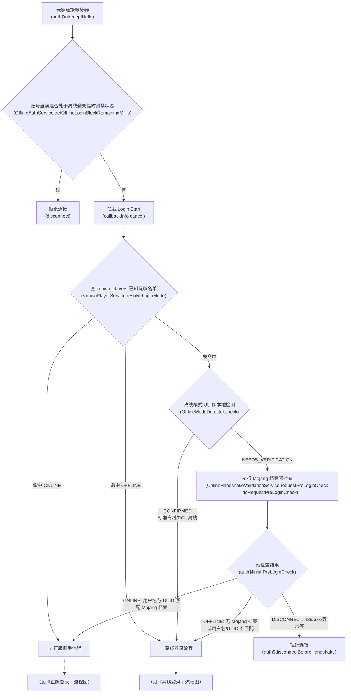
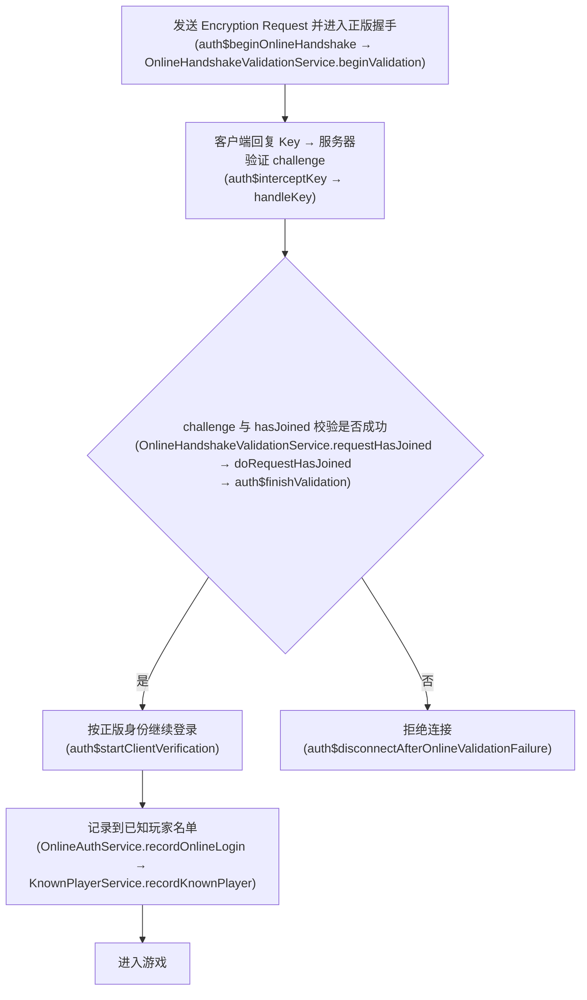
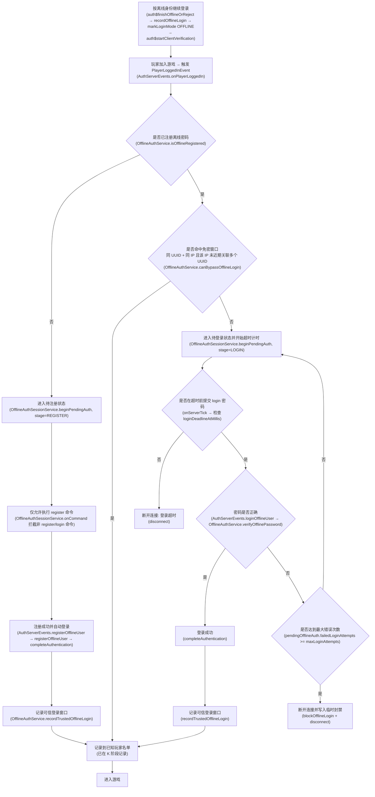

# 登录流程图

登录流程按职责分为三个阶段：**入口路由判定**（确定走正版还是离线路线）→ **正版登录** 或 **离线登录**。

## 一、入口判定：封禁检查 + 已知玩家名单 + 离线 UUID 本地检测 + Mojang 预检查

```mermaid
flowchart TD
    A["玩家连接服务器<br/>(auth$interceptHello)"] --> B{"账号当前是否处于离线登录临时封禁状态<br/>(OfflineAuthService.getOfflineLoginBlockRemainingMillis)"}
    B -- "是" --> B1["拒绝连接<br/>(disconnect)"]
    B -- "否" --> C["拦截 Login Start<br/>(callbackInfo.cancel)"]

    C --> C1{"查 known_players 已知玩家名单<br/>(KnownPlayerService.resolveLoginMode)"}
    C1 -- "命中 ONLINE" --> TO_ONLINE["→ 正版握手流程"]
    C1 -- "命中 OFFLINE" --> TO_OFFLINE["→ 离线登录流程"]

    C1 -- "未命中" --> C1_5{"离线模式 UUID 本地检测<br/>(OfflineModeDetector.check)"}
    C1_5 -- "CONFIRMED<br/>标准离线/PCL 离线" --> TO_OFFLINE
    C1_5 -- "NEEDS_VERIFICATION" --> C2["执行 Mojang 档案预检查<br/>(OnlineHandshakeValidationService.requestPreLoginCheck → doRequestPreLoginCheck)"]

    C2 --> D{"预检查结果<br/>(auth$finishPreLoginCheck)"}
    D -- "ONLINE: 用户名与 UUID 匹配 Mojang 档案" --> TO_ONLINE
    D -- "OFFLINE: 无 Mojang 档案或用户名/UUID 不匹配" --> TO_OFFLINE
    D -- "DISCONNECT: 429/5xx/异常等" --> D1["拒绝连接<br/>(auth$disconnectBeforeHandshake)"]

    TO_ONLINE -.-> E_REF["（见『正版登录』流程图）"]
    TO_OFFLINE -.-> K_REF["（见『离线登录』流程图）"]
```

## 二、正版登录

```mermaid
flowchart TD
    E["发送 Encryption Request 并进入正版握手<br/>(auth$beginOnlineHandshake → OnlineHandshakeValidationService.beginValidation)"] --> F["客户端回复 Key → 服务器验证 challenge<br/>(auth$interceptKey → handleKey)"]
    F --> G{"challenge 与 hasJoined 校验是否成功<br/>(OnlineHandshakeValidationService.requestHasJoined → doRequestHasJoined<br/>→ auth$finishValidation)"}
    G -- "是" --> H["按正版身份继续登录<br/>(auth$startClientVerification)"]
    H --> I["记录到已知玩家名单<br/>(OnlineAuthService.recordOnlineLogin → KnownPlayerService.recordKnownPlayer)"]
    I --> J["进入游戏"]
    G -- "否" --> G1["拒绝连接<br/>(auth$disconnectAfterOnlineValidationFailure)"]
```

## 三、离线登录

```mermaid
flowchart TD
    K["按离线身份继续登录<br/>(auth$finishOfflineOrReject → recordOfflineLogin → markLoginMode OFFLINE<br/>→ auth$startClientVerification)"]

    K --> JOIN["玩家加入游戏 → 触发 PlayerLoggedInEvent<br/>(AuthServerEvents.onPlayerLoggedIn)"]
    JOIN --> L{"是否已注册离线密码<br/>(OfflineAuthService.isOfflineRegistered)"}

    L -- "否" --> M["进入待注册状态<br/>(OfflineAuthSessionService.beginPendingAuth, stage=REGISTER)"]
    M --> N["仅允许执行 register 命令<br/>(OfflineAuthSessionService.onCommand 拦截非 register/login 命令)"]
    N --> O["注册成功并自动登录<br/>(AuthServerEvents.registerOfflineUser → registerOfflineUser → completeAuthentication)"]
    O --> P["记录可信登录窗口<br/>(OfflineAuthService.recordTrustedOfflineLogin)"]
    P --> R["记录到已知玩家名单<br/>(已在 K 阶段记录)"]
    R --> J["进入游戏"]

    L -- "是" --> Q{"是否命中免密窗口<br/>同 UUID + 同 IP 且该 IP 未近期关联多个 UUID<br/>(OfflineAuthService.canBypassOfflineLogin)"}
    Q -- "是" --> R
    Q -- "否" --> S["进入待登录状态并开始超时计时<br/>(OfflineAuthSessionService.beginPendingAuth, stage=LOGIN)"]
    S --> T{"是否在超时前提交 login 密码<br/>(onServerTick → 检查 loginDeadlineAtMillis)"}
    T -- "否" --> U["断开连接: 登录超时<br/>(disconnect)"]
    T -- "是" --> V{"密码是否正确<br/>(AuthServerEvents.loginOfflineUser → OfflineAuthService.verifyOfflinePassword)"}
    V -- "是" --> W["登录成功<br/>(completeAuthentication)"]
    W --> X["记录可信登录窗口<br/>(recordTrustedOfflineLogin)"]
    X --> R
    V -- "否" --> Y{"是否达到最大错误次数<br/>(pendingOfflineAuth.failedLoginAttempts >= maxLoginAttempts)"}
    Y -- "是" --> Z["断开连接并写入临时封禁<br/>(blockOfflineLogin + disconnect)"]
    Y -- "否" --> S
```
