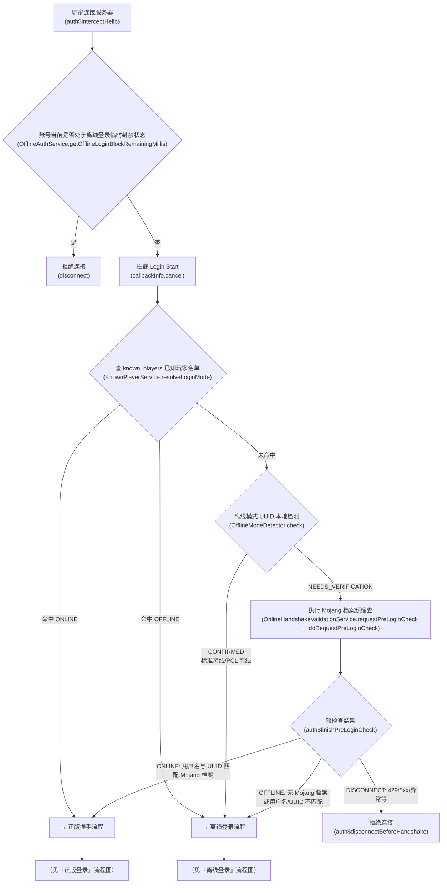
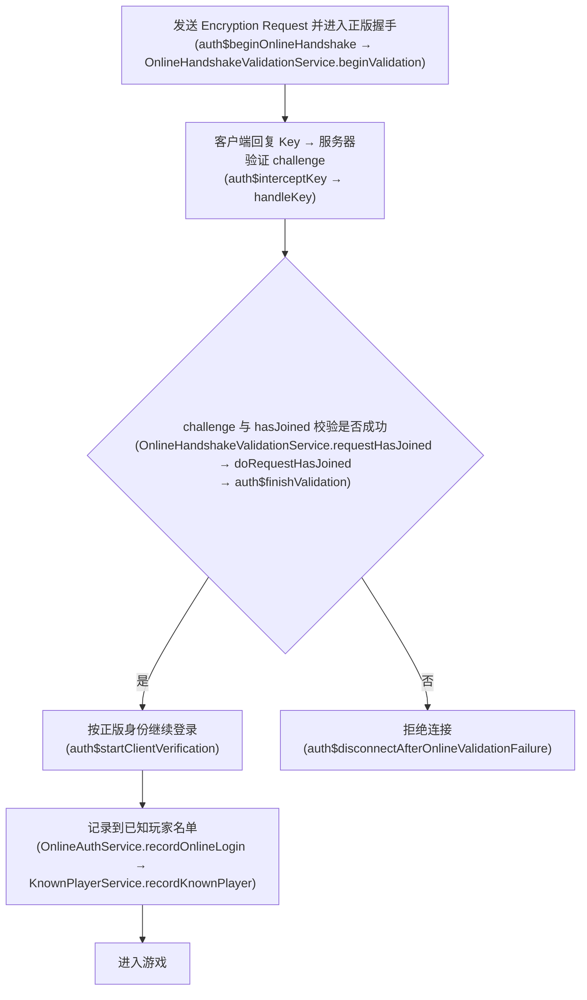
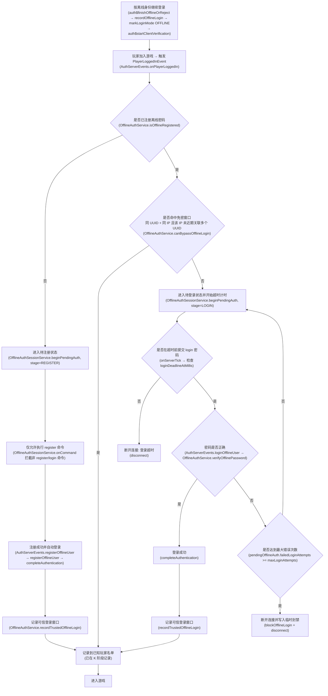

# 离线模式登录 Mod

For the English documentation, see [README.md](README.md).

为 NeoForge 1.21.1 离线模式服务器提供认证登录能力。

这个 Mod 的目标很直接：

- 离线玩家可以注册密码并完成登录。
- 正版玩家可以在离线服中走 Mojang 正版校验。
- 离线玩家在认证完成前无法移动、交互、聊天或查看真实背包。

## 主要功能

### 1. 离线玩家注册与密码登录

- 未注册的离线玩家首次进入后，可使用 `register <密码> <确认密码>` 完成注册。
- 已注册的离线玩家可使用 `login <密码>` 登录。
- 已进入游戏的玩家可使用 `auth changepassword <密码> <确认密码>` 修改自己的离线密码。

### 2. 正版账号登录校验

- 玩家连接服务器时，Mod 会在登录阶段主动发起正版握手与 Mojang 会话校验。
- 如果校验成功，玩家按正版身份进入游戏，体验与正版服务器一致。
- 登录成功的玩家将会使用正版模式的 UUID 而不是离线服务器自己生成的 UUID，这样依赖正版 UUID 的 mod 都可以正常工作（例如Figura）。

### 3. 已知玩家名单管理

- 每位成功登录的玩家（无论正版或离线）会被记录到已知玩家名单中，包含 UUID、用户名和登录模式。
- 下次登录时直接按已知模式路由，跳过 Mojang 预检查，避免触发 API 限流。
- 管理员可通过 `auth setmode <UUID|用户名> <online|offline>` 手动指定某玩家的登录模式。
- 位于名单中且标记为 ONLINE 的玩家，如果正版校验失败，将被直接拒绝登录。
- 管理员可通过 `auth remove <UUID|用户名>` 彻底清除该玩家的所有存储数据（已知名单、离线密码、封禁记录和免密登录记录）。下次加入服务器时将回到首次登录状态。

### 4. 免密登录窗口

- 已注册的离线玩家在成功登录后，会记录一次“账号 UUID + IP”的可信登录记录。
- 在配置的时间窗口内，若同一 UUID 继续从同一 IP 登录，可直接跳过密码输入。
- 如果同一 IP 在该时间窗口内关联了多个 UUID，这些 UUID 会失去免密资格，回退为正常密码登录。

### 5. 未登录状态隔离

离线玩家在完成注册或登录前，会被置于待认证状态。此时 Mod 会：

- 将玩家切换为观察者模式。
- 锁定玩家当前位置并持续施加失明效果。
- 发送空背包视图，隐藏真实背包内容。
- 拦截聊天、攻击、方块交互、容器打开、丢物等操作。
- 只允许使用 `register` 和 `login` 两个认证命令。

### 6. 可配置的安全策略

- 可配置最大密码错误次数。
- 可配置临时封禁时长。
- 可配置登录超时时间。
- 可配置提示消息重复发送间隔。
- 可配置最小密码长度。
- 可配置密码黑名单（首次启动自动创建，可直接编辑）。
- 可配置 Mojang 网络请求超时。
- 可配置默认语言与玩家语言自动识别。

## 登录流程图

登录流程按职责分为三个阶段：**入口路由判定**（确定走正版还是离线路线）→ **正版登录** 或 **离线登录**。

### 一、入口判定：封禁检查 + 已知玩家名单 + 离线 UUID 本地检测 + Mojang 预检查



### 二、正版登录



### 三、离线登录



## 配置

### 配置文件位置

- 服务端配置文件名为 `auth-server.toml`。
- NeoForge 会按 SERVER 配置规则加载该文件。
- 如果需要世界级覆盖，可使用 `world/serverconfig/auth-server.toml`。
- 修改配置后建议重启服务器，使新的认证参数在下一次启动时完整生效。

### 默认配置

```toml
[database]
path = "auth/auth"

[offline_login]
max_login_attempts = 3
temporary_block_minutes = 5
trusted_login_window_hours = 24
login_timeout_minutes = 5
prompt_interval_seconds = 5
bcrypt_cost = 12
min_password_length = 1
max_password_length = 72
password_blacklist_path = "auth/password_blacklist.txt"

[online_validation]
connect_timeout_seconds = 10
request_timeout_seconds = 10
pending_handshake_ttl_seconds = 120

[localization]
default_language = "en_us"
auto_detect_player_language = true
```

### 关键配置项说明

| 配置项 | 说明 |
| --- | --- |
| `database.path` | H2 数据库基础路径。相对路径按服务器根目录解析，默认会生成 `auth/auth.mv.db`。 |
| `offline_login.max_login_attempts` | 单次待登录阶段允许输错密码的最大次数。 |
| `offline_login.temporary_block_minutes` | 达到错误次数上限后的临时封禁时长。 |
| `offline_login.trusted_login_window_hours` | 同 UUID、同 IP 可免密登录的时间窗口。 |
| `offline_login.login_timeout_minutes` | 已注册离线玩家在待登录状态下的超时时间。 |
| `offline_login.prompt_interval_seconds` | 待认证阶段重复提示注册或登录命令的间隔。 |
| `offline_login.bcrypt_cost` | 离线密码哈希使用的 BCrypt 开销因子。 |
| `offline_login.min_password_length` | 最小密码长度（默认 1，范围 1–72）。BCrypt 输入限制为 72 字节。 |
| `offline_login.max_password_length` | 最大密码长度（默认 72，范围 1–72）。BCrypt 输入限制为 72 字节。 |
| `offline_login.password_blacklist_path` | 外部密码黑名单文件路径。文件格式为每行一个密码，`#` 开头为注释行。文件不存在时首次启动会自动从内置资源创建。相对路径按服务器根目录解析。默认生成 `auth/password_blacklist.txt`。 |
| `online_validation.connect_timeout_seconds` | 连接 Mojang 服务时的超时时间。 |
| `online_validation.request_timeout_seconds` | 请求 Mojang 服务时的超时时间。 |
| `online_validation.pending_handshake_ttl_seconds` | 登录阶段待完成正版握手的保留时间。 |
| `localization.default_language` | 默认提示语言，当前支持 `zh_cn` 和 `en_us`。 |
| `localization.auto_detect_player_language` | 登录后是否根据客户端语言在中文和英文之间自动切换提示。 |

补充说明：

- 登录前阶段无法稳定获得玩家语言，因此这一阶段始终使用 `localization.default_language`。
- 离线玩家的 UUID 强制由服务器基于用户名生成（`OfflinePlayer:<用户名>` 的哈希），保证同一用户每次登录 UUID 一致。
- 修改离线密码或由管理员重置离线密码后，旧的可信登录记录会被清除。

## 命令

### 普通玩家命令

| 命令 | 说明 |
| --- | --- |
| `register <密码> <确认密码>` | 首次注册离线密码；如果玩家已经在线进入游戏但尚未设置离线密码，也可用于创建离线密码。 |
| `login <密码>` | 使用离线密码完成登录。 |
| `auth changepassword <密码> <确认密码>` | 修改自己的离线密码。 |

### 管理员命令

| 命令 | 说明 |
| --- | --- |
| `auth setpassword <UUID\|用户名> <密码> <确认密码>` | 为指定玩家设置或重置离线密码。 |
| `auth setmode <UUID\|用户名> <online\|offline>` | 设置指定玩家的登录模式，强制其后续使用正版或离线方式登录。 |
| `auth remove <UUID\|用户名>` | 彻底清除指定玩家的所有存储数据（已知名单、离线密码、封禁记录、免密记录）。下次加入服务器时将回到首次登录状态。 |

## 运行环境

- NeoForge
- Minecraft 1.21.1

## 构建打包

```powershell
./gradlew build
```

构建产物默认输出到 `build/libs/auth-x.x.x.jar`。
